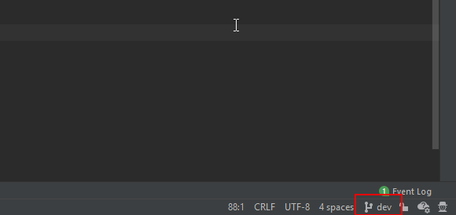
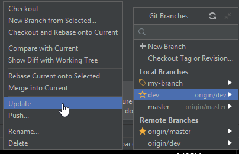
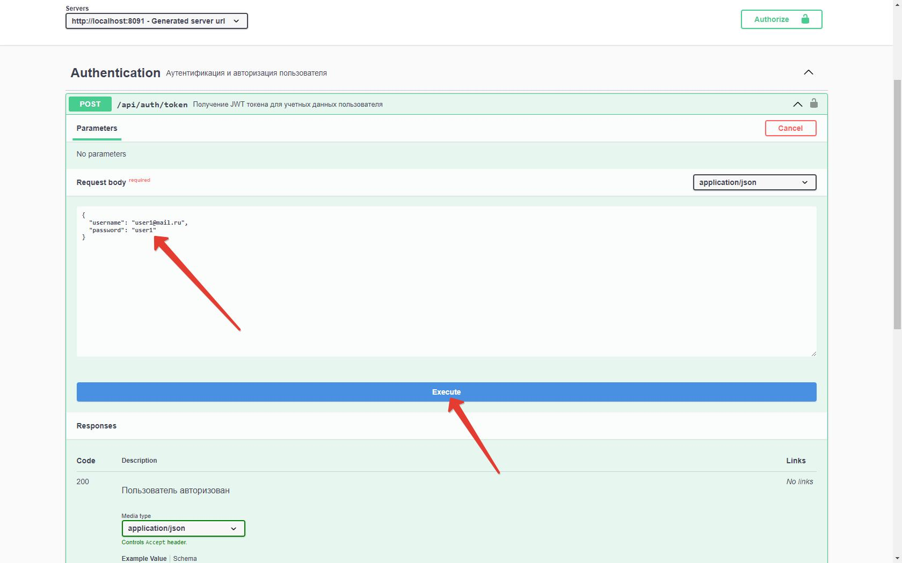
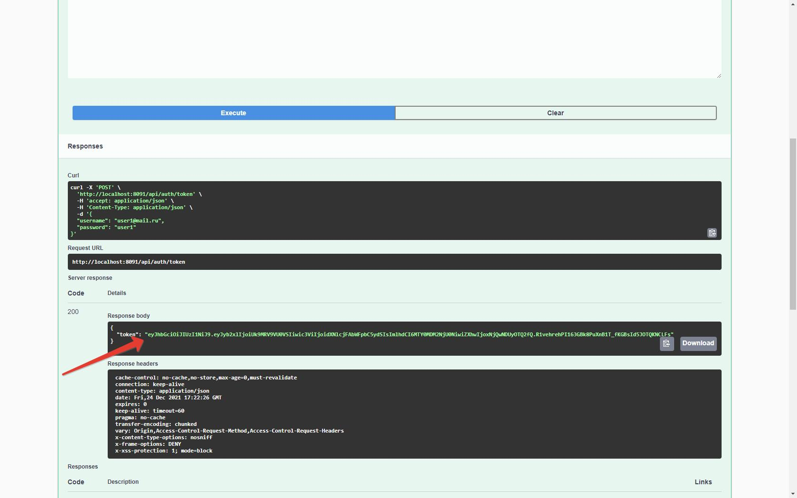
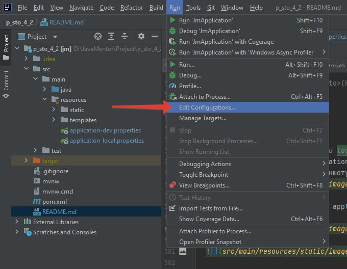
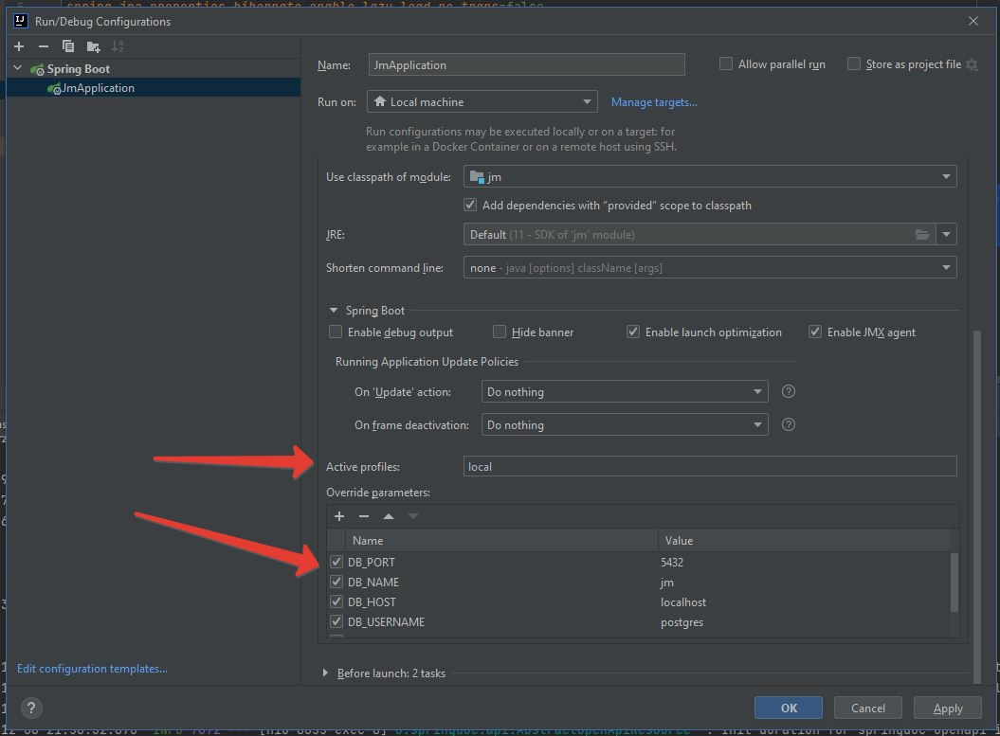
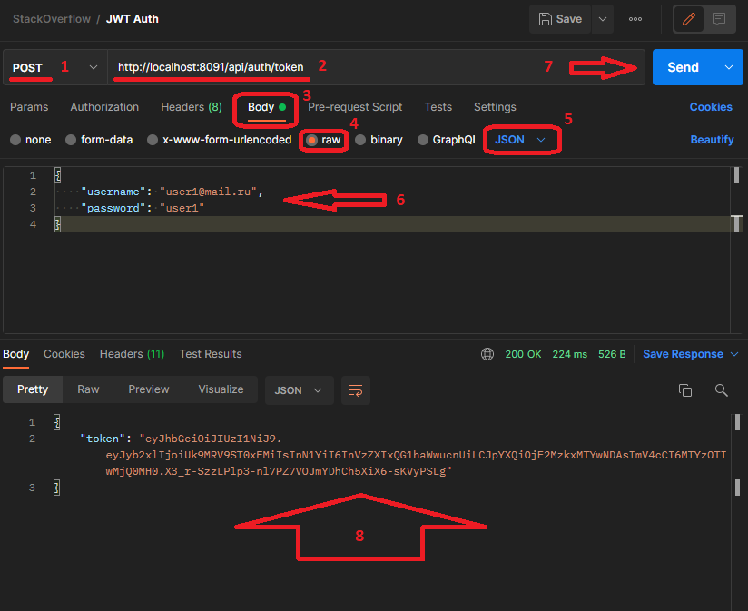

# Документация JMStack
## Работа c git
### Клонирование проекта

1. На странице репозитория убедитесь, что выбрана ветка **dev** (1), нажмите кнопку **Clone** (2), скопируйте ссылку (3).


2. Откройте **Intellij IDEA**, нажмите **Get from version control** на экране приветствия, либо **VCS | Git | Clone...** в меню.


3. Вставьте скопированную ссылку в строку **URL**, нажмите **Clone**.


### Перед внесением изменений в код
Создайте новую ветку в git-репозитории и работайте в ней. Для этого:
1. Нажмите на текущую ветку **dev** в правом нижнем углу.




2. Выберите **New branch**.


3. Введите название своей новой ветки (на ваше усмотрение) и нажмите **Create**.


### Добавление своего кода в общий репозиторий. Git push.

Прежде чем создать merge request вам необходимо подготовить вашу ветку к отправке в общий репозиторий.

1. Нажмите на текущую ветку в правом нижнем углу. Выберите опцию **dev | update**. 
Таким образом вы скачаете в свою локальную ветку **dev** все коммиты которые были замержены, 
пока вы работали в своей ветке.



2. Убедитесь, что в данный момент активна ваша рабочая ветка (занчек ярлыка слева от имени, как у ветки my-branch на скриншоте).
Выберите опцию **dev | Merge into Current**. Таким образом вы добавите все изменения из ветки **dev** в вашу ветку. При возникновении конфликтов разрешите их.


3. ---**ВАЖНО**--- Убедитесь что проект собирается и запускается.

4. Выберите вашу ветку и нажмите на **Push...**, чтобы добавить её в общий репозиторий.


### Создание merge request

1. Создайте новый merge request. В качестве **Source branch** выберите свою ветку, **Target branch** - **dev**.


2. Проверьте данные, допишите комментарии при необходимости. Обратите внимание на опцию **Delete source branch when merge request is accepted**.
Завершите создание реквеста, приложите ссылку на него в карточку таска на Trello.


## Сущности

### User

#### Поля:

- **id** - уникальный идентификационный номер пользователя;
- **fullName** - полное имя пользователя;
- **password** - пароль;
- **persistDateTime** - дата регистрации;
- **role** - идентификационный номер роли;
- **lastUpdateDateTime** - дата последней авторизации;
- **email** - адрес электронной почты;
- **about** - краткая информация о пользователе;
- **city** - город пользователя;
- **linkSite** - ссылка на сайт;
- **linkGitHub** - ссылка на github;
- **linkVk** - ссылка на страницу во Вконтакте;
- **reputationCount** - счетчик репутации;
- **isEnabled** - отметка, что учетная запись не заблокирована;
- **image** - фото пользователя;
```
Пользователь может задавать вопросы, отвечать на вопросы и давать комментарии к вопросам и ответам.
Наделен ролью.Может помечать понравившиеся вопросы, отмечать вопросы которые были полезны. Заданный
вопрос может отметить, как решенный, указав на ответ, который помог решить проблему.
```

### Role

#### Поля:

- **id** - уникальный идентификационный номер роли;
- **name** - имя роли;
```
Определяет порядок прав действий пользователя в системе.
```

### Question

#### Поля:

- **id** - уникальный идентификационный номер вопроса;
- **title** - заголовок вопроса;
- **description** - описание вопроса;
- **persistDateTime** - дата публикации вопроса;
- **viewCount** - количество просмотров;
- **user** - идентификационный номер пользователя, опубликовавший вопрос;
- **tags** - теги, которыми обозначен вопрос;
- **lastUpdateDateTime** - дата последней редакции вопроса или добавления ответа;
- **isDeleted** - флаг, помечающий объект, как удалённый. Отображаться при запросе данный вопрос не будет;
```
Сущность, которую инициализирует пользователь для публикации своего вопроса. Имеет заголовок, который кратко 
описывает суть вопроса, развернутое описание, с возможностью вставки фрагмента кода. Может быть помечен полями
“решен”, “любимый вопрос”. Отметка “решен” проставляется автором вопроса, с указанием ответа, который помог
решить возникший вопрос. Отметка “любимый вопрос” ставиться любым пользователем, который посчитал вопрос
актуальным и интересным. ”Тэг” проставляется автором вопроса, для классификации вопроса. Под вопросом может
также быть оставлен комментарий любым пользователем, включая автора вопроса.
```

### VoteQuestion

#### Поля

- **user** - пользователь, который отправил свой голос;
- **question** - вопрос, по которому ведётся голосование;
- **localDateTime** - дата и время отправки голоса;
- **vote** - значение голоса, который отправил пользователь по вопросу;
```
Таблица, которая содержит в себе записи голосования пользователей по вопросам. В таблице используется
сборный внешний ключ, который состоит из полей user, qustion, localDateTime. Для создания необходимо
передать сущности User, Question и значения голоса. Допускается передача значений только "1" и "-1".
Пользователь может проголосовать за один вопрос только с отклонением в 1 пункт. Допускается, что пользователь
может отменить свой голос, отправив противоположное значение предыдущего голоса. Или изменить свой итоговый
голос, при этом отправив повторно обратное значение. Все действия пользователя сохраняются в таблице.
Итоговое значение "полезности вопроса" является сумма всех голосов.
```

### Answer

#### Поля:

- **id** - уникальный идентификационный номер ответа;
- **user** - идентификационный номер пользователя, который опубликовал ответ;
- **question** - идентификационный номер вопроса, к которому относиться ответ;
- **htmlBody** - тело ответа;
- **persistDateTime** - дата публикации ответа;
- **updateDateTime** - дата публикации ответа;
- **isHelpful** - отметка, что именно этот ответ помог решить вопрос, к которому оно относиться. Эту
отметку может ставить только автор вопроса;
- **dateAcceptTime** - дата, решения вопроса;
- **isDeleted** - флаг, помечающий объект, как удалённый. Отображаться при запросе данный ответ не будет;
```
Сущность, которую инициализирует пользователь отвечая на вопрос. Привязан к сущности question. Ответ на
вопрос может оставлять любой пользователь. Может быть предложено несколько вариантов ответов на опубликованный
вопрос. Ответ может быть помечен автором вопроса, к которому был оставлен ответ, как “решение помогло”,
обозначая тем самым, что сам вопрос решён и помог прямо или косвенно данный ответ. Под ответом пользователи
могут оставлять комментарии, которые уточняют или дополняют предложенное решение. Каждый пользователь может
оставлять под вопросом только один ответ.
```
### AnswerVote

#### Поля

- **user** - пользователь, который отправил свой голос;
- **answer** - ответ, по которому ведётся голосование;
- **persistDateTime** - дата и время отправки голоса;
- **vote** - значение голоса, который отправил пользователь по ответу;
```
Таблица, которая содержит в себе записи голосования пользователей по ответам. В таблице используется
сборный внешний ключ, который состоит из полей user, answer, persistDateTime. Для создания необходимо
передать сущности User, Answer и значения голоса. Допускается передача значений только "1" и "-1".
Пользователь может проголосовать за один вопрос только с отклонением в 1 пункт. Не допускается, что пользователь
может отменить свой голос. Все действия пользователя сохраняются в таблице.
```


### Comment

#### Поля:

- **id** - уникальный идентификационный номер комментария;
- **user** - идентификационный номер пользователя, который оставил комментарий;
- **text** - содержание комментария;
- **persistDateTime** - дата публикации комментария;
- **lastUpdateDateTime** - дата последней редакции;
- **commentType** - тип комментария. Идентифицирует родительскую сущность, к которой был оставлен комментарий
(вопрос или ответ);
```
Комментарий оставляется пользователем под любым вопросом или ответом, для уточнения или дополнения к основному
посту.
```

### User_favorite_question

#### Поля:

- **id** - уникальный идентификационный номер записи об отмеченном вопросе;
- **persistDateTime** - дата постановки отметки “понравившейся вопрос”;
- **user** - идентификационный номер пользователя, который отметил вопрос, как понравившийся;
- **question** - идентификационный номер вопроса, который пользователь отметил, как понравившейся;
```
Отметка понравившегося вопроса проставляется пользователем, который счел вопрос интересным и/или полезным.
```

### Tag

#### Поля:

- **id** - уникальный идентификационный номер тега;
- **name** - название тега;
- **description** - описание тега;
- **persistDateTime** - дата создания тега;
- **questions** - список вопросов, которыми помечен данный тег;
```
Ставиться у сущности question для классификации вопроса.
```

### Related_tags

#### Поля:

- **id** - уникальный номер записи;
- **childTag** - идентификационный номер дочернего тега;
- **mainTag** - идентификационный номер родительского тега;
```
Категоризация тэгов. Показывает взаимосвязь общего с конкретным запросом. Например тэг “База данных” будет
иметь более широкую область запросов, в то время как тэг “Hibernate” будет более предметную область, которая
одновременно подходит под широкое использование тэга “База данных”.
```

### Tag_has_question

#### Поля

- **tag_id** - идентификационный номер тега;
- **question_id** - идентификационный номер вопроса;
- **persist_date** - дата отметки вопроса тегом;
```                                                  
Производная таблица связи many-to-many сущности вопросов и тегов.
```

### Editor

#### Поля:

- **id** - уникальный идентификационный номер редактора;
- **count** - правки сделанные за день
- **persist_date** - дата 
- **user_id** - идентификационный номер пользователя;
```
Сущность, которая хранит в себе историю редактирования вопроса, 
ответа или комментария сделанных пользователями.
```

### Moderator

#### Поля:

- **id** - уникальный идентификационный номер модератора;
- **persist_date** - дата назначения;
- **user_id** - идентификационный номер пользователя;
```
Сущность, которая хранит пользователей чей статус являеться модератором. 
Привилегия, выдаваемая системой в зависимости от уровня репутации участника.
```

### Reputation

#### Поля

- **id** - уникальный идентификационный номер репутации 
- **count** - баллы заработанные за день
- **persist_date** - дата 
- **user_id** - идентификационный номер пользователя
```
Сущность, которая хранит в себе историю репутации пользователей по дням. 
Новый день новая запись, для каждого пользователя (если пользователь заработал баллы иначе записи не будет).  
```

### Badges

#### Поля

- **id** - уникальный идентификационный номер знака 
- **badges** - имя знака
- **count** - минимальное количество очков репутации для получения знака
- **description** - описание знака
```
Сущность знаков.   
```

### user_badges 

#### Поля

- **id** - уникальный идентификационный номер знака 
- **ready** - имеет булевский тип, если помечается true знак получен
- **badges_id** - идентификационный номер знака
- **user_id** - идентификационный номер пользователя
```
Промежуточная сущность связывающая таблицы User и Badges.
User при регистрации получает все знаки лишь поле ready определяет заслужил пользователь знак или нет.
```

### Tag_ignored

#### Поля

- **id** - уникальный идентификационный номер знака 
- **user** - ссылка на профиль пользователя
- **ignoredTag** - ссылка на тег
- **persistDateTime** - дата добавления тега в справочник
```
Справочник тегов которые пользователь добавляет в игнорируемые
```

### Tag_tracked

#### Поля

- **id** - уникальный идентификационный номер знака 
- **user** - ссылка на профиль пользователя
- **trackedTag** - ссылка на тег
- **persistDateTime** - дата добавления тега в справочник
```
Справочник тегов которые пользователь добавляет в отслеживаемые 
```

### Bookmarks

#### Поля

- **id** - уникальный идентификационный номер закладки
- **user** - ссылка на профиль пользователя
- **question** - ссылка на вопрос
```
Таблица закладок
```

[Схема](https://dbdiagram.io/d/6086b027b29a09603d12295d)


## Как пользоваться конвертором MapStruct.

**MapStruct** - это генератор кода, который значительно упрощает реализацию сопоставлений между типами Java-компонентов
 на основе подхода соглашения по конфигурации.
Сгенерированный код сопоставления использует простые вызовы методов 
и, следовательно, является быстрым, безопасным по типам и простым для понимания.
Более подробно можно ознакомиться в официальной документации:https://mapstruct.org/ .

В текущем проекте **Developer Social** технология **MapStruct** используется,в основном, для 
преобразования **Dto** в **Entity** и наоборот.
Названия всех классов преобразования должны заканчиваться на «**Converter**» (например: **GroupChatConverter**) и должны храниться в пакете **converters**.
Такой класс должен быть абстрактным, помеченным аннотацией **@Mapper**.Эта аннотация отмечает класс
как класс сопоставления и позволяет процессору **MapStruct** включиться во время компиляции.
Методы должны быть абстрактными,из их названия должно быть явно понятно,какой класс
во что преобразуется. Например: (**chatDtoToGroupChat**- преобразует **ChatDto** в **GroupChat**).

Если соответствующие поля двух классов имеют разные названия, для их сопоставления
используется аннотация **@Mapping**. Эта аннотация ставится над абстрактным методом преобразования
и имеет следующие обязательные поля:

**source** - исходное поле преобразовываемого класса.
**target**- конечное поле класса,в котором должно быть значение из **source**.

Для разрешения неоднозначностей в именах полей классов можно указывать их с именем
соответствующего параметра метода преобразования.
например:(**source** = "**chatDto.title**", где **chatDto** - имя параметра метода преобразования)

По умолчанию, метод должен принимать объект преобразовываемого класса, но также
можно передавать различные другие параметры(например **Id**) и потставлять их в **source**,
чтобы в дальнейшем поле **target** приняло это значение.

Могут возникнуть ситуации,что нужно преобразовать поле в другой тип данных,например 
в коллекцию и наоборот.Тогда в аннотацию **@Mapping** следует добавить еще одно поле:
**qualifiedByName**, которое будет содержать имя метода, реализующего логику получения
нужного типа или значения. В таком случае этот метод должен быть помечен аннотацией
**@Named** c указанием названия для маппинга.
Ниже приведён общий пример:

````
{@Mapping(source = "chatDto.title", target = "title")
    @Mapping(source = "chatDto.image", target = "image")
    @Mapping(source = "userId",target ="users",qualifiedByName = "userIdToSet")
    public abstract GroupChat chatDtoToGroupChat(ChatDto chatDto,Long userId); }"
   

@Named("userIdToSet")
    public  Set<User> userIdToSet(Long userId) {
        User user = userService.getById(userId);
        Set<User> userSet = new HashSet<>();
        userSet.add(user);
        return userSet;
    }
````


# Документирование API в Java приложении с помощью Swagger и OpenAPI 3.0.

Веб-приложение часто содержит API для взаимодействия с ним. Документирование API позволит клиентам быстрее понять, как использовать ваши сервисы. Если API закрыт от внешнего мира, то все равно стоит уделить время спецификации — это поможет вашим новым коллегам быстрее разобраться с системой.

Создание документации вручную — утомительный процесс. Swagger поможет вам упростить эту работу.

## Что такое Swagger?

Swagger автоматически генерирует документацию API в виде json. А проект Springdoc создаст удобный UI для визуализации. Вы не только сможете просматривать документацию, но и отправлять запросы, и получать ответы.

Также возможно сгенерировать непосредственно клиента или сервер по спецификации API Swagger, для этого нужен генератор кода Swagger-Codegen.

Swagger использует декларативный подход. Размечаем аннотациями методы, параметры, DTO.

Swagger автоматически находит список всех контроллеров, определенных в нашем приложении. При нажатии на любой из них будут перечислены допустимые методы HTTP (DELETE, GET, HEAD, OPTIONS, PATCH, POST, PUT).

Для каждого метода доступные следующие данные: статус ответа, тип содержимого и список параметров.

## Swagger Tools
Swagger или OpenAPI framework состоит из 4 основных компонентов:

**Swagger Core** - позволяет генерировать документацию на основе существующего кода основываясь на Java Annotation.

**Swagger Codegen** - позволит генерировать клиентов для существующей документации.

**Swagger UI** - красивый интерфейс, который представляет документацию. Дает возможность просмотреть какие типы запросов есть, описание моделей и их типов данных.

**Swagger Editor** - Позволяет писать документацию в YAML или JSON формата.

### Документация ***Swagger UI*** находится по адресу: http://localhost:8091/swagger-ui.html

## Swagger Editor - онлайн-редактор, позволяет писать документацию в YAML или JSON формата.(https://editor.swagger.io/)

### URL для Swagger Editor: http://localhost:8091/v3/api-docs

После добавление нужных нам зависимостей, у нас появятся новые аннотация с помощью которых можно документировать наш код.

Вот некоторые из них:

**@Operation** - Описывает операцию или обычно метод HTTP для определенного пути.

**@Parameter** - Представляет один параметр в операции OpenAPI.

**@RequestBody** - Представляет тело запроса в операции

**@ApiResponse** - Представляет ответ в операции

**@Tag** - Представляет теги для операции или определения OpenAPI.

**@Server** - Представляет серверы для операции или для определения OpenAPI.

**@Callback** - Описывает набор запросов

**@Link** - Представляет возможную ссылку времени разработки для ответа.

**@Schema** - Позволяет определять входные и выходные данные.

**@ArraySchema** - Позволяет определять входные и выходные данные для типов массивов.

**@Content** - Предоставляет схему и примеры для определенного типа мультимедиа.

**@Hidden** - Скрывает ресурс, операцию или свойство

### Примеры использования:

````
@Tag(name = "User", description = "The User API")
@RestController
public class UserController {}
````

````
@Operation(summary = "Gets all users", tags = "user")
@ApiResponses(value = {
    @ApiResponse(
        responseCode = "200",
        description = "Found the users",
        content = {
            @Content(
                mediaType = "application/json",
                array = @ArraySchema(schema = @Schema(implementation = UserApi.class)))
        })
})
@GetMapping("/users")
public List<UserApi> getUsers()
````
````
@Schema(description = "Пользователь")
public class UserDto {

    @Schema(description = "Идентификатор", accessMode = Schema.AccessMode.READ_ONLY)
    private String key;

    @Schema(description = "ФИО", example = "Иванов Иван Иванович")
    private String name;

    @Schema(description = "Баллы пользователя", accessMode = Schema.AccessMode.READ_ONLY)
    private Long points = 0L;

    @Schema(description = "Пол пользователя")
    private Gender gender;

    @Schema(description = "Дата и время регистрации", accessMode = Schema.AccessMode.READ_ONLY)
    private LocalDateTime regDate = LocalDateTime.now();

    public UserDto() {
    }

    public UserDto(String key, String name, Gender gender) {
        this.key = key;
        this.name = name;
        this.gender = gender;
    }
//...
}
````

````
@RestController
@RequestMapping("/api/user")
@Tag(name = "Пользователи", description = "Взаимодействие с пользователями") //@API - is deprecated
public class UserController {

 @GetMapping 
 @Operation(summary = "Получение списка всех пользователей")
 public ResponseEntity<UserDto> getAll() { 
 //... 
 return new ResponseEntity<UserDto>(HttpStatus.OK); 
 } 
 
 @PostMapping 
 @Operation(summary = "Создание нового пользователя", description = "Позволяет зарегистрировать пользователя") 
 public ResponseEntity<UserDto> addUser(
    @ApiParam(
        value = "Новый User")
    @RequestBody UserDto userDto) { 
 //... 
 return new ResponseEntity<UserDto>(HttpStatus.CREATED); 
 } 
 
 @PutMapping 
 @Operation(summary = "Обновление пользователя", description = "Обновление данных пользователя") 
 public ResponseEntity<UserDto> editUser(
    @ApiParam(
        name = "Обновленный User")
    @RequestBody UserDto userDto){ 
 //... 
 return new ResponseEntity<UserDto>(HttpStatus.OK); 
 } 
 
 @DeleteMapping 
 @ApiOperation("Удаление пользователя", description = "Позволяет удалить пользователя полностью") 
 public ResponseEntity<?> deleteUser(
    @ApiParam(
        name = "Удаление Userа")
    @RequestBody UserDto userDto) 
{ 
 //... 
 return new ResponseEntity<UserDto>(HttpStatus.OK); 
 } 
}
````
### Дополнение к авторизации в OpenAPI 3.0
 В OpenAPI добавлена JWT аутентификация. Для использования нужно получить токен и внести его в данные аутентификации, как на скриншотах:
1. Используя API аутентификации проекта, нажать "Try it out".

2. Исправить логин и пароль на необходимые и нажать "Execute".

3. Ниже в поле "Server response" - "Response body" скопировать полученный токен.

4. Затем нажать кнопку "Authorize"

5. Внести скопированный токен в поле Value.

Теперь можно использовать все API, которые отображаются в OpenAPI (Swagger).

# Разделение на два профиля dev и local
- Создать две копии файла application.properties со следующими именами application-**local**.properties и application-**dev**.properties.
- Внести в них изменения по скриншоту.
  

- Затем указать Spring на нужный application.properties. Для этого нужно перейти к настройкам конфигурации запуска приложения и в поле "Active profiles" указать имя профиля, в данном случае - local.

  
- 
  

- Теперь все локальные настройки держим отдельно от серверных.
- Также при разделении на профили используя аннотацию @ActiveProfile("local") указываем спрингу, что нужно запускать с нашим профилем. Это используется при написании тестов. Аннотация ставится перед объявлением класса.
- Если вы хотите запустить сервер из командной строки, вам понадобится команда: mvn spring-boot:run -Dspring-boot.run.profiles=имя профиля
- Полное описание работы с профилями смотри здесь: https://www.baeldung.com/spring-profiles

## Описание структуры тестов
- Тесты создаются согласно рест контроллерам например если есть ResourseAnswerController то есть тест TestResourseAnswerController и тестируются все api из контроллера


- В пакете dataset/expected лежат все датасеты для сравнения получившейся базы данных после завершения теста, данные датесеты не используются для обычной загрузки данных для тестов и используются только для операции DELETE, UPDATE, PERSIST


- Все сущности описанных в датасетах для загрузки тестовых данных начинаются со id = 100 (никакого отношение к датасетам из expected не имеет )


- Все тестовые классы должны наследоваться от абстрактного класса где описана все конфигурация тестов


- НЕЛЬЗЯ ИЗМЕНЯТЬ НАПИСАННЫЕ УЖЕ ДАТАСЕТЫ! Если хотите добавить данные создаете подпакет для вашего конкретного теста и пишите свои датасеты для этого теста


- На каждый класс тестов написаны отдельные датасеты в случаи где их нужно изменить применяется п. 5. Например если мы тестируем ResourseAnswerController, есть подпакет dataset/[название пакета] и тут лежат все датасеты нужные для тестирования этого контроллера


- Нельзя использовать аннотации тразакции для тестов


- Нельзя ставить аннотацию DataSet над классом, для каждого отдельного метода теста стоит свой датасет


- Все классы для тестов находиться в папке .../api

# Использование JWT авторизации в Postman
- Открываем Postman
  
1. Выбираем POST запрос
2. Указываем http://server_address:port/api/auth/token
3. Выбираем Body
4. raw
5. Тип данных JSON
6. Указываем имя пользователя и пароль, для которого мы хотим получить токен
7. Нажимаем Send
8. Получаем token

- Далее копируем содержимое "token" 


1. Идем на вкладку Authorization
2. Выбираем тип Bearer Token
3. Вставляем наш токен в поле.

После этого можно работать с сервисами, соответствующим привилегиям пользователя, под которым мы авторизовались.

# Миграция базы данных через Flyway.

- Миграция (migration) – процесс преобразования одной структуры базы данных в другой без потери консистентности, при котором меняется схема (таблицы и их колонки, индексы и пр.).
- Для непрерывного надежного и простого изменения схемы базы данных нашего приложения будем использовать Flyway.
- Миграции могут быть версионными и повторяющимися. Первые имеют уникальную версию и применяются только один раз. У вторых номера версии нет, и они применяются, когда у них изменяется контрольная сумма.
- В нашем приложении будем использовать первый вариант.

Для этого:
1. Добавляем зависимость flyway-core в pom.xml.
2. Создаем каталог для файлов миграций (db/migration).
3. Добавляем внешний конфигурационный файл flyway.properties, который должен находиться в том же каталоге, что и pom.xml. В нем указываем данные для подключения к нашей БД и местоположение для файлов миграций (spring.flyway.locations=filesystem:db/migration).
4. Создаем первую миграцию, используя данные, которые Hibernate выводит в консоль. Для этого в файле application.properties указываем следующие параметры: spring.jpa.hibernate.ddl-auto=create и spring.jpa.show-sql=true. Запускаем приложение, создается таблица в соответствии с моделью нашей БД. Копируем из консоли SQL-запрос, создаем файл миграции V1__Init_DB.sql в каталоге db/migration и редактируем его в соответствии с требованиями нашей БД (postgresql). Пересоздаем заново нашу БД jm (удаляем и создаем).
5. Изменяем параметры в application.properties (spring.jpa.hibernate.ddl-auto=validate), чтобы при создании БД использовался файл миграции для валидации.
6. Запускаем приложение.

- Flyway придерживается следующего соглашения об именовании сценариев миграции:
  <Префикс><Версия>__<Описание>.sql

Где:
- <Префикс> – по умолчанию V.
- <Версия> – номер версии миграции. Основные и второстепенные версии могут быть разделены символом подчеркивания. Версия миграции всегда должна начинаться с 1.
- <Описание> – текстовое описание миграции. Описание должно быть отделено от номеров версий двойным подчеркиванием.

Пример: ***V1_1_0__my_first_migration.sql*** или ***V001__InitDB.sql***

## Как работает Flyway.

Для отслеживания когда, кем и какие миграции были применены в схему базы данных добавляется специальная таблица с метаданными. В этой таблице также хранятся контрольные суммы миграций и информация о том, успешна была миграция или нет.

Фреймворк работает следующим образом:
1. Проверяет схему базы данных на наличие таблицы метаданных (по умолчанию SCHEMA_VERSION). Если таблица метаданных не существует, то создает ее.
2. Сканирует classpath на наличие доступных миграций.
3. Сравнивает миграции с таблицей метаданных. Если номер версии меньше или равен версии, помеченной как текущая, то игнорирует ее.
4. Отмечает все оставшиеся миграции как ожидающие (pending). Потом сортирует их по возрастанию номеров версий и выполняет в указанном порядке.
5. По мере применения миграций обновляет таблицу метаданных.

## Команды.
В Flyway есть следующие основные команды по управлению миграциями:
- Info. Отображение текущего состояния / версии схемы базы данных. Информация о том, какие миграции ожидаются, какие были применены, состояние выполненных миграций и дата их выполнения.
- Migrate. Обновление схемы базы данных до текущей версии. Сканирование classpath для поиска доступных миграций и применение ожидающих миграций.
- Baseline. Установка версии схемы базы данных, игнорируя миграции до baselineVersion включительно. Baseline помогает использовать Flyway на уже существующей базе данных. Новые миграции применяются в обычном режиме.
- Validate. Проверка текущей схемы базы данных на соответствие доступным миграциям.
- Repair. Восстановление таблицы метаданных.
- Clean. Удаление всех объектов в схеме. Не используйте clean в продакшен базах данных!

## Header, Side-Bar, Footer
Для добавления header, side-bar и footer на веб-страницу необходимо в вашем html файле внутри тега body создать элемент с тэгом div и присвоить ему id="main".
В данном элементе необходимо располагать ваш html код, который должен быть отображён на вашей странице.
Также перед закрывающимся тегом body необходимо добавить:
````
<script type="text/javascript" src="/js/scriptName.js"></script>
````
В качестве "scriptName" необходимо использовать имя скрипта из перечисленных ниже:
- initScriptAuthorized - добавляет на страницу header, footer и side-bar (для авторизованного пользователя)
- initScriptUnauthorized - добавляет на страницу header, footer и side-bar (для НЕавторизованного пользователя, имеются кнопки Log in и Registration)

HTML код страницы с добавленными heading, side-bar, footer:
```
<!DOCTYPE html>
<html lang="en">
<head>
    <meta charset="UTF-8">
    <title>Title</title>
</head>
<body>
<div id="main">
  Your content
</div>
<script type="text/javascript" src="/js/initScriptAuthorized.js"></script>
</body>
</html>
```
